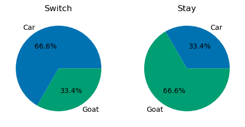

# The Monty Hall Problem

The Monty Hall problem is a brain teaser and probability puzzle. Famously employed by the game show *Let's Make A Deal*, the problem is named after the show's host Monty Hall. However, there was also significant academic interest in the theoretical solutions to the problem starting in the 1970s.

Here is a description of the problem, as posed in Marilyn vos Savant's Parade magazine column "Ask Marilyn" in 1990:

>Suppose you're on a game show, and you're given the choice of three doors: Behind one door is a car; behind the others, goats. You pick a door, say No. 1, and the host, who knows what's behind the doors, opens another door, say No. 3, which has a goat. He then says to you, "Do you want to pick door No. 2?" Is it to your advantage to switch your choice?

While it may be implied by the question, for additional clarification:

1. The host must always open a door that was not selected by the contestant.
2. The host must always open a door to reveal a goat and never the car.
3. The host must always offer the chance to switch between the door chosen originally and the closed door remaining.

Counterintuitively, Savant concluded that always switching to the offered door resulted in a 2/3 chance of winning. I couldn't wrap my head around it, and I wasn't alone. This problem has confounded even some statisticians and game theorists for decades.

My struggle to grasp the strategy involved in this paradoxical problem has led me to want to simulate the results for a demonstrable solution. I hope this project helps you understand the problem as much as it helped me.

## Files

To jump in without further ado, here are the files used:

- [monty_hall_nb.ipynb](monty_hall_nb.ipynb) is a Jupyter Notebook which contains a description, demonstration, and analysis of the problem.
- [monty_hall.py](monty_hall.py) is a Python file containing the functions used to recreate/simulate the problem.
- The [visualizations](visualizations) folder contains results of the simulations and a decision tree of possible outcomes used in explaining the conditional probabilities involved.

## Results

After running 1 million simulations of the problem, the results supported the theory that always switching to the newly offered door resulted in a 2/3 chance of winning, while staying with the originally chosen door had a 1/3 chance of winning.

This is congruent with the logical solution posed by Savant and the solution calculated via conditional probability.

## Conclusions

More information about the problem's history, theoretical solutions, and possible explanations can be found in the [notebook file](monty_hall_nb.ipynb). For much more information, I would recommend the excellent Monty Hall problem [Wikipedia page](https://en.wikipedia.org/wiki/Monty_Hall_problem).
